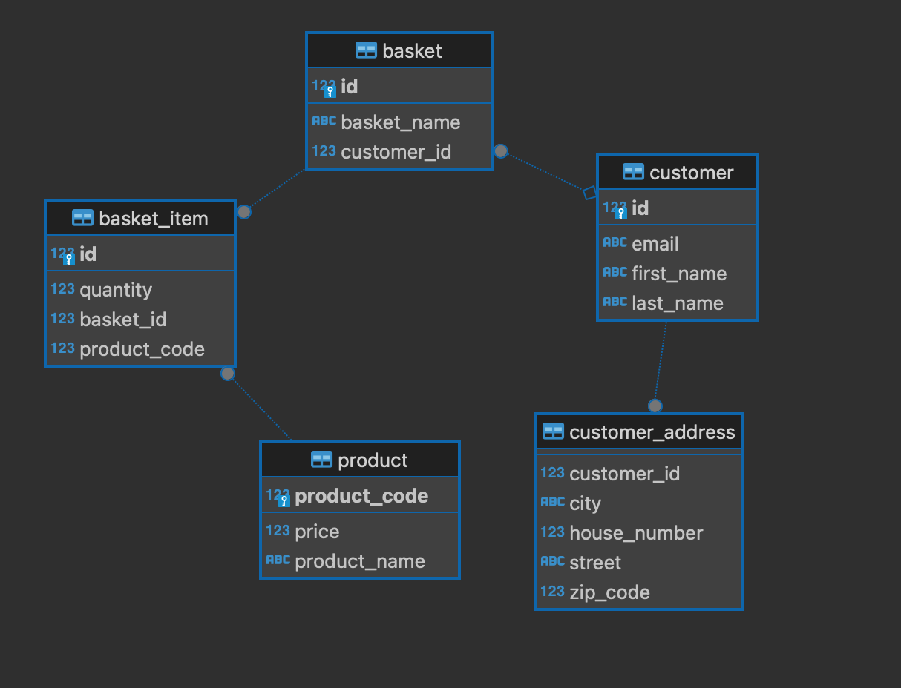

    

# Shopping Manager
## Overview
ShoppingManager is a Spring Boot application for managing customers and their shopping details. It includes features for CRUD operations, logging, and exception handling.

## Technologies used
- **Language**: Java 17
- **Framework**: Spring Boot 3
- **Database**: PostgreSQL
- **Working with DB**: Hibernate, JPA, Spring Data
- **Mapping**: MapStruct
- **Exception handling**: Controller advice
- **Build System**: Maven 3.9.5
- **Version control**: Git/GitHub
- **Logging**: SLF4J, Log4j2, Lombok

## Database scheme

## [Postman http requests examples](https://github.com/wtypmah24/ShoppingManager/tree/main/postman_requests)

